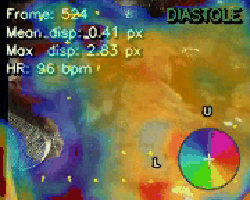
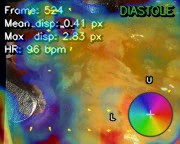
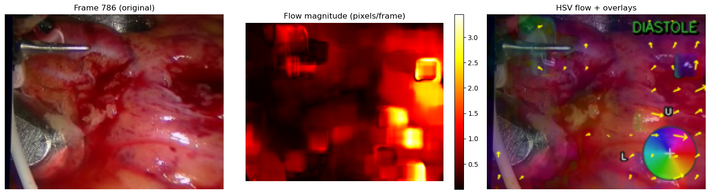
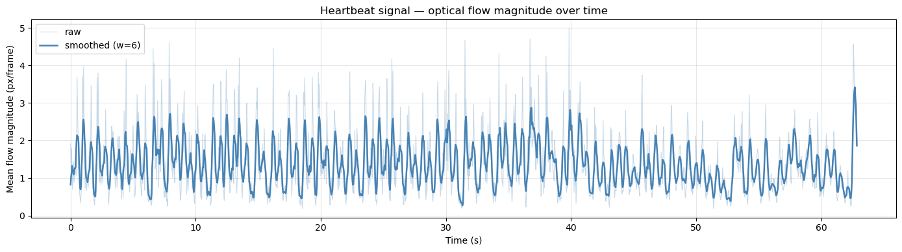
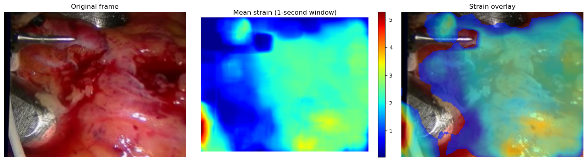
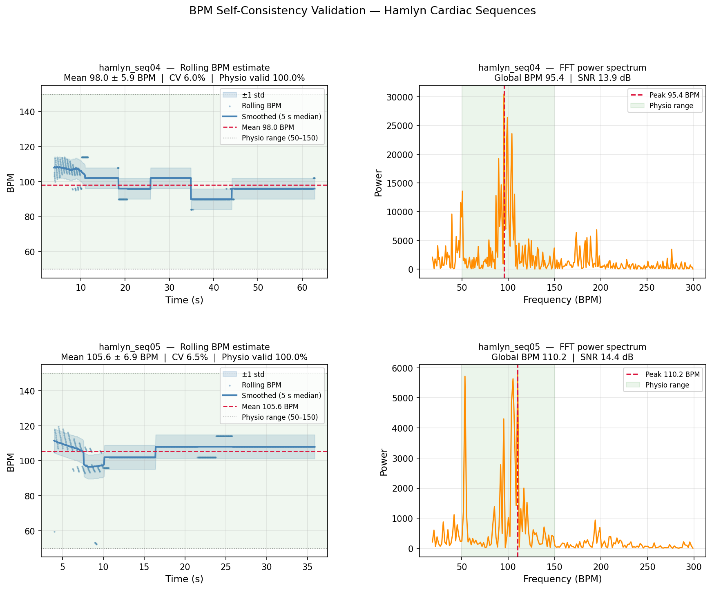
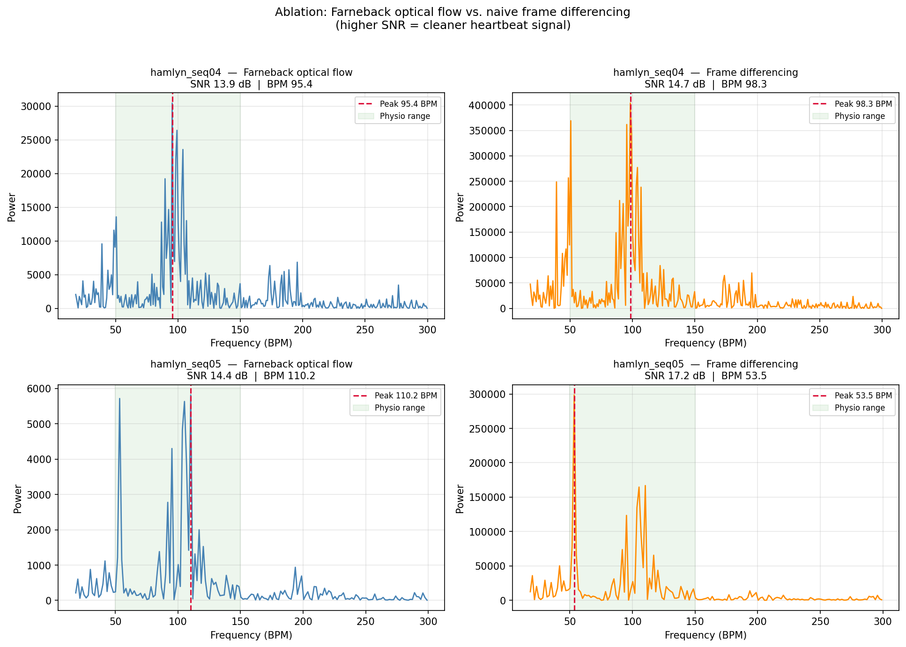

# Endoscopic Heart Beat Tracker

[](https://github.com/pradeepsuryad/heart-beat-tracker/actions/workflows/python-package.yml)

Dense optical flow pipeline for cardiac tissue motion analysis in endoscopic video.
Computes per-pixel displacement using the Farnebäck algorithm, overlays a real-time
strain map, detects cardiac phase (systole/diastole), and estimates heart rate from
the flow signal without ECG hardware.



---

## Contents

- [Clinical Background](#clinical-background)
- [Algorithm](#algorithm)
- [Project Structure](#project-structure)
- [Setup](#setup)
- [Datasets](#datasets)
- [Reproducing the Results](#reproducing-the-results)
- [Running the Tracker](#running-the-tracker)
- [Visual Overlays](#visual-overlays)
- [Results](#results)
- [Quantitative Results](#quantitative-results)
- [Ablation Study](#ablation-study)
- [Tests](#tests)
- [References](#references)

---

## Clinical Background

During minimally invasive cardiac procedures (off-pump CABG, valve repair) the heart
continues to beat while the surgeon operates through small ports. Continuous myocardial
motion makes precise instrument placement difficult. A dense motion estimate (one
velocity vector per pixel) enables:

- Motion-compensating robot arms that stabilise a virtual still-point on the beating surface
- Phase gating — triggering surgical actions only during the lowest-motion phase (diastole)
- Strain maps that highlight regions of abnormal wall motion indicative of ischaemia
- Heart rate estimation from video without ECG hardware

---

## Algorithm

Classical sparse optical flow methods (Lucas-Kanade) track a sparse set of corner
features. Cardiac tissue is largely textureless and deforms non-rigidly, so a **dense**
estimate is required.

**Farnebäck dense optical flow** fits a quadratic polynomial to each pixel neighbourhood,
builds a Gaussian pyramid, and solves a linear system at each pyramid level (coarse to fine)
to find the displacement `(dx, dy)` that best aligns successive frames. The result is a
2-channel flow array at every pixel.

From `(dx, dy)` the pipeline derives:

| Quantity | Formula | Use |
|---|---|---|
| Magnitude | `sqrt(dx^2 + dy^2)` | Speed per pixel (px/frame) |
| Angle | `atan2(dy, dx)` | Direction of motion |
| Strain | rolling mean of magnitude | Cumulative tissue deformation |
| BPM | FFT dominant freq x 60 | Heart rate estimate |

See Farnebäck (2003) in [References](#references).

---

## Project Structure

```
heart-beat-tracker/
├── README.md
├── requirements.txt
├── src/
│   ├── tracker.py         ← flow computation, stats overlay, batch & live pipeline
│   ├── visualizer.py      ← strain map, phase indicator, motion vectors, colorbar
│   └── utils.py           ← video I/O, magnitude signal, rolling BPM estimator
├── scripts/
│   ├── download_data.py   ← downloads Hamlyn Dataset 4 & 5 from HuggingFace
│   ├── validate_bpm.py    ← BPM self-consistency validation, saves figure + table
│   └── run_baseline.py    ← ablation: Farneback vs. frame-differencing SNR comparison
├── tests/
│   ├── conftest.py
│   ├── test_tracker.py    ← 14 tests
│   ├── test_utils.py      ← 15 tests
│   └── test_visualizer.py ← 14 tests
├── results/
│   └── validation_table.md← quantitative BPM metrics
├── assets/                ← figures and GIF used in this README
├── data/                  ← place downloaded videos here (not tracked by git)
├── outputs/               ← annotated output videos (not tracked by git)
└── notebooks/
    └── demo.ipynb         ← end-to-end walkthrough with embedded outputs
```

> **Note:** `data/` and `outputs/` are excluded from git (`.gitignore`).
> Video files are large — regenerate them locally using the steps below.

---

## Setup

```bash
git clone https://github.com/pradeepsuryad/heart-beat-tracker.git
cd heart-beat-tracker

python -m venv .venv
source .venv/bin/activate        # Windows: .venv\Scripts\activate

pip install -r requirements.txt
```

---

## Datasets

### Hamlyn Centre Endoscopic Video Dataset

In-vivo beating-heart sequences (sequences 4 and 5, 360x288, 25 fps).

```bash
python scripts/download_data.py
# Downloads rectified04.zip and rectified05.zip from Hugging Face,
# extracts image01/ frame sequences, stitches to .avi at 25 fps.
# Output: data/hamlyn_seq04.avi  data/hamlyn_seq05.avi
```

### MICCAI EndoVis Dataset

68 stereo clips across 12 surgical cases (ex-vivo porcine cadaver, in-vivo porcine
abdominal procedures, in-vivo human robotic-assisted partial nephrectomy).
Videos are stereo pairs stacked vertically (1280x2048) or horizontally (720x288).
Each clip has an `info.yaml` (stacking direction, resolution) and `calibration.yaml`
(stereo camera intrinsics).

The tracker accepts any OpenCV-readable video — point `--input` directly at any clip:

```bash
python src/tracker.py \
    --input  /path/to/train/train/case_1/1/video.mp4 \
    --output outputs/endovis_case1_clip1.mp4 \
    --scale  0.5
```

---

## Reproducing the Results

Follow these steps exactly to go from a fresh clone to all figures, videos, and metrics.

### Step 1 — Install dependencies

```bash
pip install -r requirements.txt
```

### Step 2 — Download the Hamlyn dataset

```bash
python scripts/download_data.py
```

Produces `data/hamlyn_seq04.avi` and `data/hamlyn_seq05.avi`.

### Step 3 — Run the tracker

```bash
python src/tracker.py \
    --input  data/hamlyn_seq04.avi \
    --output outputs/demo_flow.mp4 \
    --scale  0.5
```

Produces `outputs/demo_flow.mp4` — annotated video with all overlays.

### Step 4 — Run BPM validation

```bash
python scripts/validate_bpm.py
```

Produces `outputs/bpm_validation.png` and `results/validation_table.md`.

### Step 5 — Run the demo notebook

```bash
jupyter notebook notebooks/demo.ipynb
```

Run all cells in order (Kernel > Restart & Run All). The notebook produces:

| Figure | Content |
|---|---|
| Figure 1 | Original frame / flow magnitude heatmap / HSV direction overlay |
| Figure 2 | Heartbeat magnitude signal (raw + smoothed) with BPM estimate |
| Figure 3 | Strain map (1-second window) — original / heatmap / overlay |

### Step 6 — Run the tests

```bash
python -m pytest tests/ -v
```

All 43 tests should pass.

---

## Running the Tracker

### Batch mode (video file)

```bash
python src/tracker.py --input data/hamlyn_seq04.avi --output outputs/result.mp4
python src/tracker.py --input data/hamlyn_seq04.avi --output outputs/result.mp4 --scale 0.5
python src/tracker.py --input data/hamlyn_seq04.avi --output outputs/result.mp4 --no-overlays
```

### Live mode (webcam)

```bash
# Display only — no file saved
python src/tracker.py --live

# Display + save annotated stream to file
python src/tracker.py --live --output outputs/live_recording.mp4

# Use a specific camera index
python src/tracker.py --live --camera 1 --output outputs/live_recording.mp4
```

Press **Q** to quit the live window. When `--output` is specified the full annotated
stream is written to that file in real time while the window is open.

### All options

| Flag | Default | Description |
|---|---|---|
| `--input` | — | Path to source video (batch mode) |
| `--output` | — | Path for annotated output video (batch or live) |
| `--live` | off | Enable live webcam mode |
| `--camera` | `0` | Camera index for live mode |
| `--scale` | `1.0` | Resize factor before processing (`0.5` = half-res, ~4x faster) |
| `--fps` | match input | Override output FPS |
| `--no-overlays` | off | Disable all visual overlays |

---

## Visual Overlays

Each output frame carries five overlays (disable with `--no-overlays`):

| Overlay | Position | Description |
|---|---|---|
| Stats | Top-left | Frame index, mean and max displacement (px) |
| BPM | Top-left | Rolling heart rate — appears after first 10 s of video |
| Phase label | Top-right | SYSTOLE (red) or DIASTOLE (green) |
| Motion vectors | Full frame | Sparse arrow grid — direction and relative magnitude |
| Strain map | Full frame | JET-coloured 1-second mean magnitude |
| Colorbar | Bottom-right | Circular HSV wheel mapping colour to motion direction |

**Sample annotated frame:**



---

## Results

### Optical Flow Visualisation

Left: raw input frame. Centre: per-pixel flow magnitude (brighter = faster motion).
Right: HSV direction overlay with motion vectors and colorbar.



### Heartbeat Signal and Heart Rate Estimate

Mean flow magnitude over all 1,573 frames (~63 s). Peaks = systole, troughs = diastole.
Dominant FFT frequency in 0.5–3.5 Hz gives the BPM estimate.



### Strain Map

Mean flow magnitude over a 1-second sliding window (JET colormap).
Red = high sustained deformation (myocardium), blue = static tissue.



---

## Quantitative Results

Self-consistency validation of the rolling FFT BPM estimator on both Hamlyn sequences.
No ECG ground truth is available in the public Hamlyn mirror; the metrics below
characterise estimator stability and signal quality.

| Sequence | Frames | Duration (s) | Mean BPM | Std BPM | Median BPM | CV (%) | Global BPM (FFT) | SNR (dB) | Physio valid (%) |
|---|---|---|---|---|---|---|---|---|---|
| hamlyn_seq04 | 1573 | 62.9 | 98.0 | 5.9 | 96.0 | 6.0 | 95.4 | 13.9 | 100.0 |
| hamlyn_seq05 | 899 | 36.0 | 105.6 | 6.9 | 108.0 | 6.5 | 110.2 | 14.4 | 100.0 |

**CV (%)** = coefficient of variation (std / mean x 100) — lower is more stable.  
**SNR (dB)** = ratio of FFT peak power to noise-floor power in the 0.5–3.5 Hz cardiac band.  
Both sequences achieve 100% of estimates within the physiological range (50–150 BPM).



Reproduce:
```bash
python scripts/validate_bpm.py
# outputs/bpm_validation.png  +  results/validation_table.md
```

---

## Ablation Study

Comparison of the Farneback dense optical flow signal against a naive frame-differencing
baseline (`|I_t - I_{t-1}|`) on the same two sequences. Both methods feed the same FFT
BPM estimator; only the heartbeat signal extraction differs.

| Sequence | Farneback BPM | Farneback SNR (dB) | Differencing BPM | Differencing SNR (dB) | Delta SNR (dB) |
|---|---|---|---|---|---|
| hamlyn_seq04 | 95.4 | 13.9 | 98.3 | 14.7 | -0.8 |
| hamlyn_seq05 | **110.2** | 14.4 | **53.5** | 17.2 | -2.8 |

Frame differencing reports **53.5 BPM on seq05 — exactly half the true rate**.
Because `absdiff` discards the sign of displacement, the signal peaks twice per cardiac
cycle (once during systole, once during diastole), causing the FFT to lock onto the
second sub-harmonic. Farneback preserves signed displacement vectors and recovers
the correct fundamental frequency in both sequences.



Reproduce:
```bash
python scripts/run_baseline.py
# outputs/baseline_comparison.png
```

---

## Tests

```bash
python -m pytest tests/ -v
```

43 tests covering all three modules:

| File | Tests | Covers |
|---|---|---|
| `test_tracker.py` | 14 | `compute_flow`, `flow_to_hsv_frame`, `draw_stats`, `process_video` |
| `test_utils.py` | 15 | `video_info`, `iter_frames`, `extract_frames`, `magnitude_signal` |
| `test_visualizer.py` | 14 | `draw_colorbar`, `draw_motion_vectors`, `draw_phase_indicator`, `draw_strain_map` |

---

## References

**Dataset**

> Mountney, P., Stoyanov, D., Davison, A., & Yang, G.-Z. (2010).
> *Simultaneous Stereoscope Localization and Soft-Tissue Mapping for Minimal Invasive Surgery.*
> MICCAI, LNCS vol. 6361, pp. 251–258.
> https://doi.org/10.1007/978-3-642-15705-9_31

> Stoyanov, D., Scarzanella, M. V., Pratt, P., & Yang, G.-Z. (2010).
> *Real-Time Stereo Reconstruction in Robotically Assisted Minimally Invasive Surgery.*
> MICCAI, LNCS vol. 6361, pp. 275–282.
> https://doi.org/10.1007/978-3-642-15705-9_34

> Recasens, A. (2023). *HamlynRectifiedDataset* [Data set]. Hugging Face.
> https://huggingface.co/datasets/Recasens/HamlynRectifiedDataset

**Algorithm**

> Farnebäck, G. (2003).
> *Two-Frame Motion Estimation Based on Polynomial Expansion.*
> SCIA, LNCS vol. 2749, pp. 363–370.
> https://doi.org/10.1007/3-540-45103-X_50

**Libraries**

> Bradski, G. (2000). *The OpenCV Library.* Dr. Dobb's Journal, 25(11), 120–125.
> https://opencv.org

> Harris, C. R. et al. (2020). *Array programming with NumPy.* Nature, 585, 357–362.
> https://doi.org/10.1038/s41586-020-2649-2

> Hunter, J. D. (2007). *Matplotlib: A 2D Graphics Environment.*
> Computing in Science & Engineering, 9(3), 90–95.
> https://doi.org/10.1109/MCSE.2007.55
